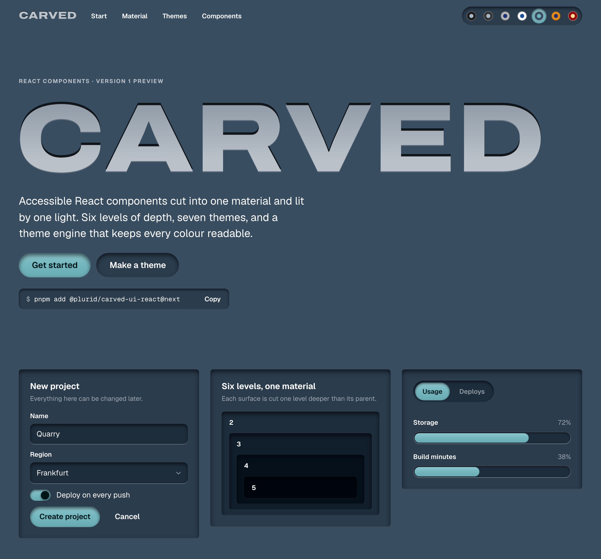
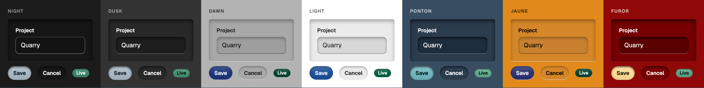

<p align="center">
  
</p>

<h1 align="center">Carved</h1>

<p align="center">
  Accessible React components cut into one material and lit by one light.
</p>

<p align="center">
  <a href="https://github.com/plurid/carved-ui/actions/workflows/ci.yml"></a>
  <a href="https://www.npmjs.com/package/@plurid/carved-ui-react"></a>
  <a href="LICENSE"></a>
</p>

<p align="center">
  <a href="https://plurid.github.io/carved-ui/"><b>Documentation</b></a> ·
  <a href="https://plurid.github.io/carved-ui/themes">Theme lab</a> ·
  <a href="https://plurid.github.io/carved-ui/lab/">Laboratory</a> ·
  <a href="docs/migration.md">Migrating from 0.x</a>
</p>

<br />

<picture>
  <source media="(prefers-color-scheme: light)" srcset="docs/assets/carved-light.png" />
  
</picture>

## The material

Carved has one idea: every surface is a recess cut into a single material, lit by a single light. Four rules follow from it, and every component keeps them.

- **Depth is shade.** Each nested surface is cut one level deeper and darker than its parent, down to six levels.
- **One light.** A single angle places every shadow, lit edge and engraving, so the whole interface agrees. Change it and everything is relit together.
- **Touch cuts deeper.** Hovering deepens a control's cut; pressing deepens it again, so a button gives way like a key.
- **Meaning is inlaid.** Accent, success, warning and danger are set into the cut rather than glowing above it. Only moving pieces rise: a switch's knob, a slider's knob, a keycap.

## Quick start

```sh
pnpm add @plurid/carved-ui-react@next
```

Import the stylesheet once, wrap your app in a provider, and build:

```tsx
import {
  Button,
  CarvedProvider,
  Form,
  Select,
  SelectItem,
  TextField,
} from '@plurid/carved-ui-react';
import '@plurid/carved-ui-react/styles.css';

export function NewProject() {
  return (
    <CarvedProvider theme="ponton">
      <Form onSubmit={(event) => event.preventDefault()}>
        <TextField label="Project name" isRequired description="Shown to your whole team." />
        <Select label="Region" placeholder="Choose a region">
          <SelectItem id="fra">Frankfurt</SelectItem>
          <SelectItem id="iad">Virginia</SelectItem>
        </Select>
        <Button type="submit">Create project</Button>
      </Form>
    </CarvedProvider>
  );
}
```

Labels, descriptions, validation messages, keyboard behaviour and focus management come with every field. When a design needs a different arrangement, the parts of each composed component are exported too. Read the [getting started guide](docs/getting-started.md) for themes, depth, locales and server rendering.

## Seven materials, or your own



Each preset (`night`, `dusk`, `dawn`, `light`, `ponton`, `jaune`, `furor`) is generated from one colour and an accent chosen for it. Yours needs only the colour; the accent and the other tones are derived unless you choose them:

```tsx
import { createTheme } from '@plurid/carved-ui-core';

const forest = createTheme({ color: '#284c42', shadowAngle: 120 });

<CarvedProvider theme={forest}>…</CarvedProvider>;
```

The theme engine builds six depths in OKLCH, keeping the hue steady, then solves every colour on them for contrast. On every depth of every theme, text reaches 4.5:1, control edges 3:1, and the accent, success and danger inlays 3:1. Try it in the [theme lab](https://plurid.github.io/carved-ui/themes), which shows the contrast report as you go.

## Components

| Family      | Components                                                                                                           |
| ----------- | -------------------------------------------------------------------------------------------------------------------- |
| Foundations | `CarvedProvider`, `Surface`, `Card`                                                                                  |
| Actions     | `Button`, `IconButton`, `Link`, `ToggleButton`, `ToggleButtonGroup`, `Toolbar`                                       |
| Fields      | `TextField`, `SearchField`, `NumberField`, `Checkbox`, `CheckboxGroup`, `RadioGroup`, `Switch`, `Slider`, `Fieldset` |
| Dates       | `DatePicker`, `DateRangePicker`, `DateField`, `TimeField`, `Calendar`, `RangeCalendar`                               |
| Colour      | `ColorPicker`, `ColorArea`, `ColorSlider`, `ColorWheel`, `ColorField`, `ColorSwatch`, `ColorSwatchPicker`            |
| Files       | `DropZone`, `FileTrigger`, `FileList`, `FileItem`                                                                    |
| Collections | `Select`, `ComboBox`, `ListBox`, `Menu`, `DataTable`, `GridList`, `Tree`, `TagGroup`                                 |
| Overlays    | `Modal`, `Drawer`, `Dialog`, `AlertDialog`, `Popover`, `Tooltip`, `CommandPalette`                                   |
| Navigation  | `Tabs`, `Accordion`, `Disclosure`, `Breadcrumbs`, `Pagination`                                                       |
| Feedback    | `Alert`, `ToastRegion`, `ProgressBar`, `Meter`, `Spinner`, `Skeleton`                                                |
| Content     | `Heading`, `Separator`, `Badge`, `Avatar`, `AvatarGroup`, `Kbd`, `Table`                                             |

Interaction, focus and screen reader behaviour come from [React Aria](https://react-spectrum.adobe.com/react-aria/). Every component is documented on the [site](https://plurid.github.io/carved-ui/components) with live examples and its full API. Patterns that every app shapes differently, like settings forms, confirmations, searchable tables, empty states and page frames, are [recipes](docs/examples/README.md) to copy and make your own.

## Packages

| Package                                                                            | What it holds                                                                                                                  |
| ---------------------------------------------------------------------------------- | ------------------------------------------------------------------------------------------------------------------------------ |
| [`@plurid/carved-ui-react`](https://www.npmjs.com/package/@plurid/carved-ui-react) | The components and their stylesheet                                                                                            |
| [`@plurid/carved-ui-core`](https://www.npmjs.com/package/@plurid/carved-ui-core)   | The material without React: tokens, the theme engine and its CSS, and the tokens as [DTCG](https://www.designtokens.org/) JSON |

Both are ES modules with TypeScript declarations, and tree-shake from a single entry point. They need **React 19** and support **Chrome 120, Firefox 121 and Safari 17.2** or newer. The stylesheet is plain CSS in cascade layers with no runtime, so components render on the server, and any `--carved-*` custom property can be overridden.

Version 1 is a preview, published under the `next` tag. It is a rewrite of the 2019 library: the [migration guide](docs/migration.md) maps every 0.x component to its replacement.

## Documentation

- [Getting started](docs/getting-started.md): install, theme, compose, override and render on the server
- [Accessibility](docs/accessibility.md): what is guaranteed, what is tested, and what is yours to do
- [Architecture](docs/architecture.md): how the packages, the theme engine and the material fit together
- [Recipes](docs/examples/README.md): editable patterns built from the components
- [Contributing](docs/contributing.md): development, checks and releases

## Develop

```sh
pnpm install
pnpm dev        # the laboratory: every component in every state, at localhost:6006
pnpm dev:site   # the documentation site, at localhost:5173
pnpm check      # lint, types, tests in three browsers, builds and packed-package checks
```

| Directory        | What lives there                                                 |
| ---------------- | ---------------------------------------------------------------- |
| `packages/core`  | Tokens, the theme engine and the material: no React              |
| `packages/react` | The components and their stylesheet                              |
| `apps/site`      | The documentation site, built with Carved                        |
| `apps/storybook` | The laboratory, whose stories are also the interaction tests     |
| `docs`           | Guides, and recipes in `docs/examples`                           |
| `tools`          | Build scripts, shared configuration and the browser test suites  |
| `legacy`         | The original HTML, Vue and design implementations, for reference |

## License

[MIT](LICENSE) © 2019 Plurid, Inc.
