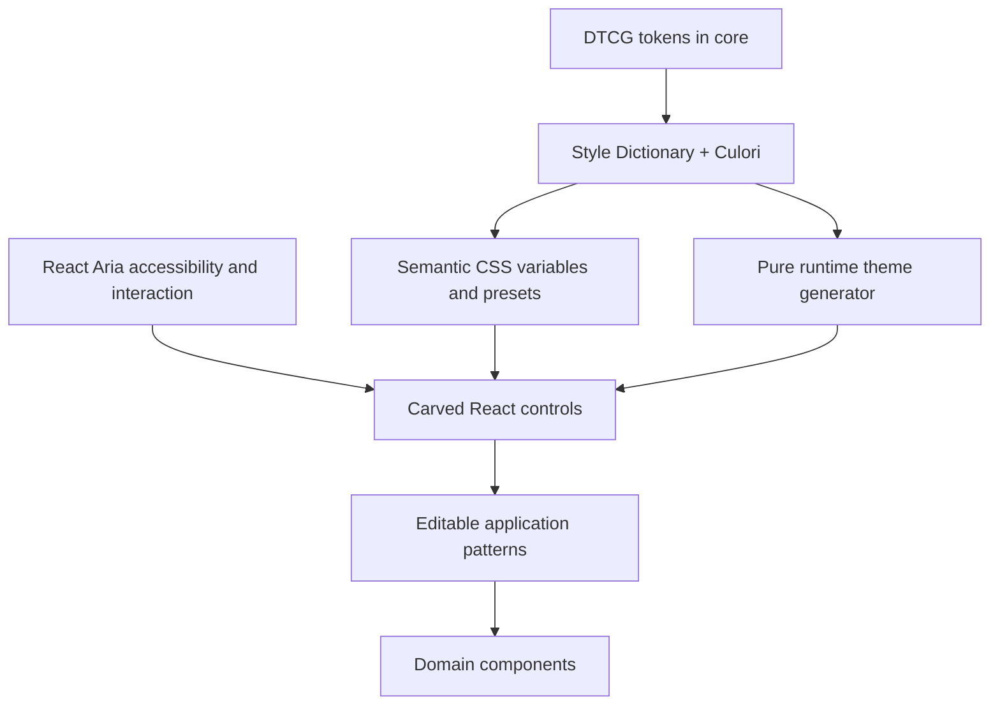

# Architecture

Carved v1 separates the design language from React behavior and from application patterns. It preserves the recessed surface identity while replacing the original React 16/Lerna/Rollup/CRA toolchain and constructor-driven theme propagation.

## Package boundaries

**Core** owns values and transformations shared by future frameworks: token JSON, the six-depth color ramp, contrast selection, shadow geometry and immutable theme data. It imports neither React nor DOM APIs. Build-time CSS presets call exactly the same function as runtime themes. Generated files are outputs, never a second source of truth.

**React** owns native markup, visual composition and React Aria adapters. React Aria is a direct dependency rather than a separately published primitives package. Splitting the same React-specific behavior into another package would add versioning and API obligations without a second consumer. Add a framework-neutral common utility to core only after its contract is real; do not put JSX, hooks or arbitrary application helpers there.

**Patterns** are editable source in `docs/examples`, executed in Storybook. Settings submission, confirmation, search and layout naturally change in each application. They own domain state and async work. A registry is deferred until there is a stable set of source assets and an actual distribution need. Data grids, complex date selection, uploads and command palettes are future patterns, outside the production core scope.

There is no icons package yet: the few internal SVGs live together, decorative icons are hidden from assistive technology, and consumers can compose their chosen icon set. No generic Box/CSS-prop abstraction is added.

## Public API

Small semantic variants (`primary`, `secondary`, `ghost`, `danger`) and sizes (`sm`, `md`, `lg`) are complemented by composition. Dialogs, cards, fields, collections and navigation expose named parts. Native HTML props and React Aria state contracts remain visible; native buttons, links, labels, fieldsets and tables retain their behavior.

The package uses plain named exports rather than compound properties on function objects. This keeps individual parts directly importable, typed and tree-shakable. Component subpaths resolve to the same cohesive implementation modules, avoiding dozens of shallow index files. Consumers may use `ComponentProps<typeof Button>` and the explicitly exported foundational prop types.

Refs use the React 19 prop convention. Controlled and uncontrolled state belong to React Aria. Native content components use native attributes. State is exposed through React Aria data attributes and small Carved variant/depth attributes. Table is a styled native table; it does not promise a data grid.

## Themes and depth

`packages/core/tokens/tokens.json` uses DTCG `$type` and `$value` objects. Style Dictionary emits foundation variables; Culori generates concrete OKLCH surfaces, readable foregrounds and borders. Current CSS targets Chrome 120+, Firefox 121+ and Safari 17.2+; the stylesheet build keeps syntax compatible with those targets.

`CarvedProvider` renders a scoped div and an I18nProvider. Independent providers can coexist. `Surface` increments context depth across arbitrary wrappers, supports an explicit 0–5 override, and saturates at 5. React context replaces display-name inspection and recursive child cloning.

CSS uses namespaced selectors and cascade layers, with semantic `--carved-*` variables as the public styling boundary. There is no document mutation during render, global reset, injected stylesheet or CSS-in-JS runtime. Application overrides follow normal CSS inheritance. A custom theme accepts concrete opaque colors; applications that override generated colors own contrast validation of their overrides.

React Aria portals leave the provider DOM subtree. The overlay adapter snapshots the owning provider/surface's computed token variables and direction, then observes style, class, direction and theme attribute changes on its ancestors. It also responds to color-scheme changes. This preserves scoped theme, depth and CSS overrides during an open overlay. Custom media-query overrides for viewport size should instead update provider state/style; arbitrary stylesheet replacement is not observed.

## Build and distribution

pnpm links only the two packages and Storybook. Archived HTML/Vue/demo sources are excluded explicitly. TypeScript emits ESM JavaScript, declarations and maps; there is no library bundler to flatten React client directives. Lightning CSS bundles/minifies the opt-in stylesheet. Style Dictionary builds token outputs. Vite powers Storybook and a consumer fixture, not the published JavaScript.

React is a peer dependency. CSS is marked as a side effect and has import declarations. Export maps expose only supported entry points. Package checks validate tarball contents, client directives, declarations, licenses, CSS, tree shaking, server rendering and hydration in isolated installed Vite/Next consumers. Changesets versions both public packages; releases use the `next` channel until a deliberate stable promotion.

## Why these choices

React Aria was chosen for integrated field validation, collections, overlays, internationalization, and keyboard/focus behavior across this catalog. Radix would also be viable, but mixing both expands dependency and interaction contracts. Tailwind is unnecessary for the library styling boundary; apps can use it alongside scoped CSS. DTCG tokens provide a portable source format without introducing a Figma/native build before a consumer exists.

The core remains small enough to review. Framework-specific behavior stays together, and application patterns stay editable. The old package identity is retained while its API changes explicitly for v1.

Primary references: [DTCG format](https://www.designtokens.org/tr/2025.10/format/), [React Aria](https://react-spectrum.adobe.com/react-aria/), [React 19 ref props](https://react.dev/reference/react/forwardRef), [ARIA authoring patterns](https://www.w3.org/WAI/ARIA/apg/), [Storybook testing](https://storybook.js.org/docs/writing-tests).
