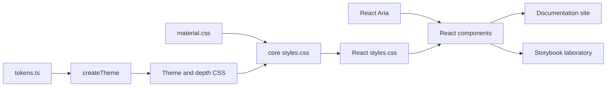

# Architecture

Carved is two packages and two applications around one idea: every surface is cut into a single material, lit by a single light.

## The core package

`@plurid/carved-ui-core` has no React and no DOM code. It holds:

- **Tokens** (`src/tokens.ts`): space, radius, type, motion and layering, written in the Design Tokens Community Group format, plus the seven preset themes. This file is the single source of truth; `tokens.json` is generated from it.
- **The theme engine** (`src/theme.ts`): `createTheme` turns one colour into a theme. It builds six depths in OKLCH, keeping hue steady and the whole ramp on one side of mid-grey, then solves text, muted text, edges and four inlays so their contrast holds on every depth. It also places the light. It is pure and deterministic, so the same function makes the preset CSS at build time and custom themes at runtime.
- **The material** (`src/material.css`): the primitives every component composes (`carved-carve`, `carved-inlay`, `carved-raise`, `carved-engrave`, `carved-trench`). Each reads the light from custom properties, so a theme relights everything at once. Inlays are polished: `--carved-sheen` brightens the side of every tone fill that faces the light, using the same angle as the shadows.
- **CSS output** (`src/css.ts`): `themeToCss`, the depth rules that map `[data-carved-depth]` to a level's colours, and the assembled stylesheet.

## The React package

`@plurid/carved-ui-react` wraps React Aria components in the material.

- **Composed and parts.** `TextField`, `Select`, `Slider` and the rest lay out their own parts from props. Their roots (`TextFieldRoot`, `SelectRoot`, `SliderRoot`, …) and parts (`Label`, `Description`, `FieldError`, `ListBox`, `Popover`, …) are exported for other arrangements.
- **Depth is context.** `Surface` reads the depth of its nearest ancestor surface and adds one. Overlays take the depth of the surface that opened them.
- **Overlays render inside their provider.** `CarvedProvider` renders a host element and points React Aria's portal provider at it, so popovers and dialogs inherit the provider's theme, overrides, language and direction through the DOM. A nested provider's host moves into the root host, beyond any scrolling or clipping container.
- **Server components.** Static content lives in `content.tsx`, which has no hooks and never imports React Aria. Every other module is a client module.
- **One stylesheet.** `src/styles/*.css`, one file per family, bundled with the core stylesheet into `styles.css` in three cascade layers: `carved.tokens`, `carved.material`, `carved.components`. Application CSS outside a layer always wins.

## The applications

- **The documentation site** (`apps/site`) is built with Carved: Vite, React Router and MDX. The guides are this folder's Markdown, so GitHub and the site show the same text. Each example file is rendered live and shown as code. API tables are generated from the components' types and JSDoc. Every route is prerendered.
- **The laboratory** (`apps/storybook`) shows every component in every state, and its stories are the interaction tests.

Both develop against package source through a shared Vite plugin (`tools/vite/carved.ts`). It aliases the packages to `src`, and regenerates the core stylesheet from the theme engine when a token changes.

## Decisions

- **React Aria** provides keyboard interaction, focus management, collections, overlays and internationalisation that would otherwise take years to get right. Carved adds the material on top and keeps React Aria's props visible.
- **Plain CSS and custom properties** rather than CSS-in-JS: no runtime, server rendering for free, and overrides with ordinary CSS.
- **OKLCH, solved per theme**, rather than hand-picked colours: any base colour gets the same structure and the same contrast guarantees. Tone seeds are minerals, low in chroma, rather than stock primaries; the engine keeps each seed's hue and chroma and solves only its lightness.
- **Focus is a lit edge.** For keyboard use only, a focused control's own edge lights up, drawn inside its shape, rather than a ring floating around it. A focused field is lit as a whole: light falls straight in, so its shadow shortens, its floor lifts evenly and a crisp rim of the focus colour runs all the way round, never along one edge.
- **Recipes stay editable.** Patterns that every application shapes differently (settings forms, confirmations, searchable tables, page frames) live in `docs/examples` as source to copy, not as packaged components.
- **A well that holds controls is a surface.** A data table, tree, grid list, standalone calendar or drop zone is cut one level below its surface and sets that depth, so the rows, days and buttons inside it can cut deeper still. A tree goes further: each open level is a well of its own.
- **What is not here yet**: virtualised grids with editable cells, drag-and-drop reordering and rich text editing. They can start as recipes and move into the packages once their shape settles.
